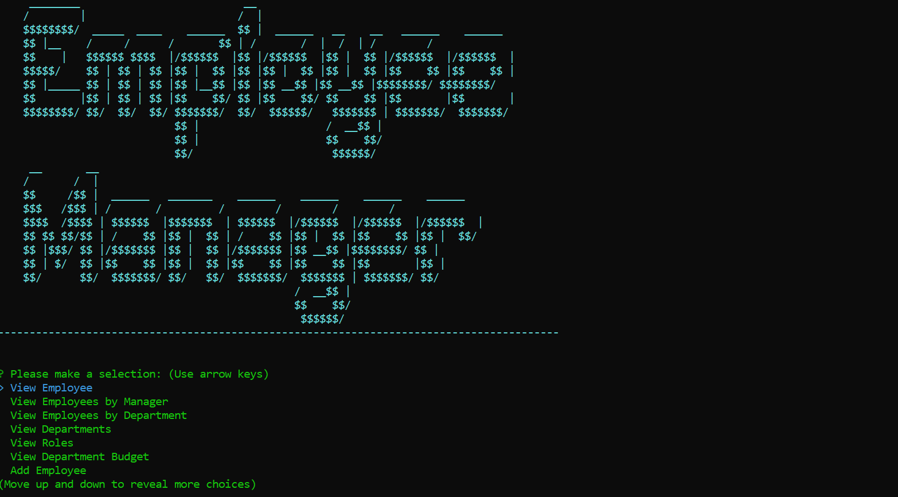

# MYSQL Employee Database Tracker

---

## User Story

"As a business owner
I want to be able to view and manage the departments, roles, and employees in my company
So that I can organize and plan my business"

## Description

Command-line application to view and manage departments, roles, and employees in a company.

---

## Table of Contents

* [Installation](#installation)
* [Languages/Dependencies/Resources](#languages/dependencies/resources)
* [Usage](#usage)
* [Questions/Contact](#questions/contact)
* [Badges](#badges)

## Installation

run npm i

## Languages/Dependencies/Resources

* JavaScript
* MySQL
* Node.js
* Inquirer
* Chalk

## Usage

run node index.js

<h2>Screenshot of Employee Database Main Menu:</h2>

<h2>Command line application in action:</h2>

## Questions/Contact

For additional information contact me at: 

GitHub: [@HelenIL](https://github.com/HelenIL/)

Email: [helenilindberg@yahoo.com](mailto:helenilindberg@yahoo.com)

## Badges

